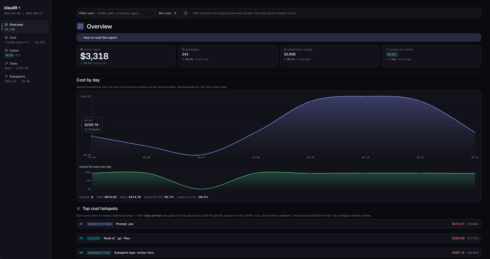

# claudit

Audit your Claude Code session JSONL files for token and cost spend.

claudit reads the `.jsonl` session logs that Claude Code writes under `~/.claude/projects/` and reports where the money went — by project, model, tool, subagent, and individual user prompt. The default output is a single self-contained HTML file you open in a browser; markdown and JSON are also supported for piping into other tools.



## Install

```sh
go install github.com/kurofune/claudit/cmd/claudit@latest
```

Requires Go 1.26 or later. The binary lands in `$GOBIN` (usually `~/go/bin`).

## Quick start

```sh
# One-shot HTML report from every session under ~/.claude/projects/
claudit > report.html

# Last week, scoped to one project
claudit --last=7d --project=myrepo > report.html

# Compare the last 7 days to the 7 days before (markdown by default; --html renders side-by-side bars)
claudit diff
claudit diff --html > diff.html
claudit diff --by=month --html > diff.html   # last 30 days vs prior 30 days

# Or pin the windows explicitly
claudit diff --a=2026-04-01..2026-04-15 --b=2026-04-15..2026-05-01

# Tail the currently-running session and watch cost accrue
claudit watch --budget=5.00
```

Run `claudit help` for the subcommand list and `claudit <cmd> --help` for per-command flags.

## What it reports

- **Totals.** Turns, sessions, tokens (input / output / cache-read / 5m-cache-write / 1h-cache-write), cost in USD, and the time range covered.
- **By model.** Spend split across the models you actually called.
- **By project.** Per-cwd spend, so you can see which repos are driving the bill.
- **By tool.** Bash, Read, Edit, Grep, WebFetch, etc., with drill-down into Bash patterns, file extensions read, grep globs, and web hosts fetched.
- **Subagent attribution.** Sidechain (subagent) cost separated from main-thread cost, with per-invocation rows and per-agent-type roll-ups.
- **Per-prompt cost.** Every user prompt's downstream cost, computed by walking the conversation's parent links.
- **Cache efficiency.** Hit ratio overall plus the worst-offender prompts and tools driving cache misses.
- **Hotspots.** Top cost drivers with a copyable LLM prompt for each, so you can paste the prompt into a model and get specific advice on that exact driver.
- **Sessions drill-down (HTML only).** Top sessions by cost, each expandable to show the ordered user prompts and the assistant turns each one produced — per-turn model, tokens, cost, and which tools fired. Capped via `--sessions=N` (default 50; `--sessions=0` disables the view). Use `--redact` to replace prompt bodies with `[redacted N chars]` before sharing a report.
- **Trends.** Day/week/month buckets with sparklines.

## Privacy

claudit runs entirely on your machine:

- It reads `.jsonl` files already on disk (the ones Claude Code wrote there).
- It reads a local pricing YAML.
- It writes an HTML, JSON, or markdown report to stdout.

The CLI makes no network calls. The HTML report references Inter from Google Fonts for typography, so opening it in a browser fetches the font from `fonts.googleapis.com` — your IP and User-Agent reach Google, but none of the report's content (prompts, paths, costs) does. Offline, the report falls back to system sans-serif. Hotspot prompts are copyable text — pasting them into a model is your decision.

One thing to know if you plan to share a report: the **Sessions drill-down** view inlines your prompt text (truncated to 2000 chars per prompt). The text never leaves the report, but if the file does, the prompts go with it. Pass `--redact` to replace prompt bodies with `[redacted N chars]` — costs, tokens, tool names, and timestamps are still emitted, just not the conversation content. Pass `--sessions=0` to omit the view entirely.

## Pricing config

Prices live at `~/.config/claudit/prices.yaml`. On first run, claudit writes an embedded default into that path. The format is per-million-token USD rates:

```yaml
models:
  claude-opus-4-7:
    input_per_mtok: 15.00
    output_per_mtok: 75.00
    cache_read_per_mtok: 1.50
    cache_write_5m_per_mtok: 18.75
    cache_write_1h_per_mtok: 30.00
```

Override the path with `--prices=path/to/file.yaml`. Models that appear in your sessions but are missing from `prices.yaml` show up in the report's `unknown_models` block with zero attributed cost — add them to the YAML to get them priced.

## Subcommands

| Command | Purpose |
|---|---|
| `report` | Generate a cost/usage report. Default if no subcommand is given. |
| `diff` | Compare two date ranges and report top movers. |
| `watch` | Tail the active session JSONL and print running cost. |

`claudit help` shows the subcommand list; `claudit <cmd> --help` shows per-command flags.

## Status and limitations

- The JSONL schema is Claude Code's. If Anthropic changes it, the parser may need to catch up.
- Prices are manually maintained in `prices.yaml`. When Anthropic publishes new rates, you update the YAML.
- Developed and dogfooded on macOS. CI runs the test suite on Linux, macOS, and Windows. On Windows, `claudit watch`'s live status line uses ANSI escape sequences — Windows Terminal and PowerShell 7 render them correctly; legacy `cmd.exe` will show the escapes literally.
- The HTML report is a single file with all data, CSS, and JS inline. Typography uses Inter via Google Fonts (the lone external request); offline it falls back to system sans-serif.

## License

MIT — see [LICENSE](LICENSE).
