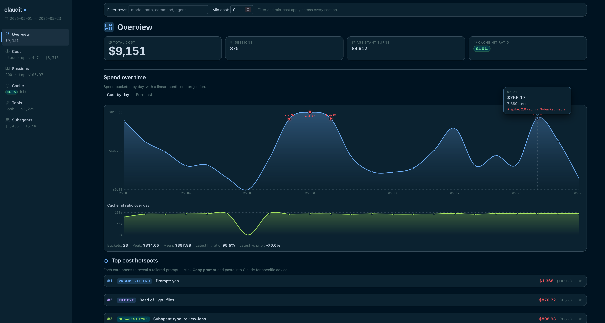
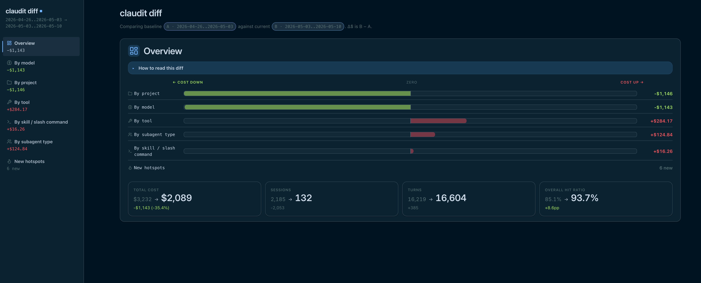
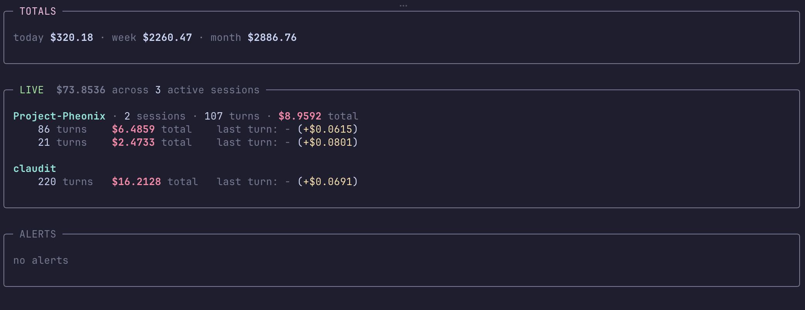
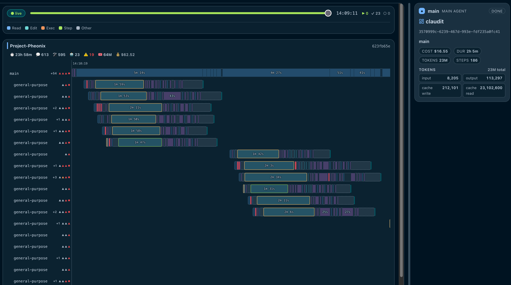

# claudit

[](https://github.com/kurofune/claudit/actions/workflows/ci.yml)
[](https://github.com/kurofune/claudit/releases)
[](LICENSE)

Audit your Claude Code session JSONL files for token and cost spend.

claudit reads the `.jsonl` session logs that Claude Code writes under `~/.claude/projects/` and reports where the money went — by project, model, tool, subagent, and individual user prompt. The default output is a single self-contained HTML file you open in a browser; markdown and JSON are also supported for piping into other tools.

Run as a local web app (`claudit serve`), it also opens up the **Agents** view: a full trace of what each session's agents actually did — every turn, tool call, and sub-agent on a real timeline, with automatic anomaly detection. See [The Agents view](#the-agents-view).







## Install

```sh
go install github.com/kurofune/claudit/cmd/claudit@latest
```

Requires Go 1.26 or later. The binary lands in `$GOBIN` (usually `~/go/bin`).

## Quick start

```sh
# Run a local web daemon — auto-reloads as new turns land, filter via URL
claudit serve                         # http://127.0.0.1:8787
claudit serve --port=9000 --open=false
# Filters live in the query string, views in the URL hash:
#   http://127.0.0.1:8787/?project=myrepo&last=7d
#   http://127.0.0.1:8787/?since=2026-05-01&until=2026-05-15&by=week#cost
#   http://127.0.0.1:8787/#agents              # the Agents trace viewer
#   http://127.0.0.1:8787/#agents/timeline     # deep-link a specific lens

# Tail the currently-running session and watch cost accrue
claudit watch --budget=5.00

# Or tail every recently-modified session under ~/.claude/projects, grouped by project
claudit watch --all

# One-shot HTML report from every session under ~/.claude/projects/
claudit > report.html

# Last week, scoped to one project
claudit --last=7d --project=myrepo > report.html

# Compare the last 7 days to the prior 7 days (HTML by default)
claudit diff > diff.html
claudit diff --by=month > diff.html          # last 30 days vs prior 30 days

# Or pin the windows explicitly
claudit diff --a=2026-04-01..2026-04-15 --b=2026-04-15..2026-05-01 > diff.html
```

Run `claudit help` for the subcommand list and `claudit <cmd> --help` for per-command flags.

Date filters (`--since` / `--until`, `diff`'s `--a` / `--b` ranges, and serve's `?since` / `?until`) are calendar dates interpreted at midnight in your **local** time zone — consistent with `--last` and the `watch` rolling totals.

## What it reports

- **Totals.** Turns, sessions, tokens (input / output / cache-read / 5m-cache-write / 1h-cache-write), cost in USD, and the time range covered.
- **By model.** Spend split across the models you actually called.
- **By project.** Per-cwd spend, so you can see which repos are driving the bill.
- **By tool.** Bash, Read, Edit, Grep, WebFetch, etc., with drill-down into Bash patterns, file extensions read, grep globs, and web hosts fetched.
- **Subagent attribution.** Sidechain (subagent) cost separated from main-thread cost, with per-invocation rows and per-agent-type roll-ups.
- **Per-prompt cost.** Every user prompt's downstream cost, computed by walking the conversation's parent links.
- **Cache efficiency.** Hit ratio overall plus the worst-offender prompts and tools driving cache misses.
- **Hotspots.** Top cost drivers with a copyable LLM prompt for each, so you can paste the prompt into a model and get specific advice on that exact driver.
- **Agent traces (`claudit serve` only).** The Agents view reconstructs each session turn-by-turn — the ordered user prompts and the assistant turns each one produced, every tool call (with the exact input/output), and every sub-agent — on a timeline, with automatic anomaly detection. See [The Agents view](#the-agents-view). Pass `--redact` (or `?redact=true` in the URL) to replace prompt and tool-I/O bodies with `[redacted N chars]` before sharing.
- **Trends.** Day/week/month buckets with sparklines.
- **Anomalies.** Trend buckets with abnormal cost spikes or cache hit-ratio drops are flagged inline — coral dots in the HTML chart, an `## Anomalies` section in markdown, and an `anomalies` field in JSON.

## The Agents view

`claudit serve` adds an **Agents** tab that turns the raw transcript into a trace you can actually read and audit — not just "where did the money go," but "what did the agent *do*." It's a `serve`-only view (a static one-shot `claudit report` doesn't include it). Open it at `http://127.0.0.1:8787/#agents`.



Everything you click — an agent, a turn, or a single tool call — fills one shared **detail drawer** on the right (input, output, status, reasoning, tokens, cost, model, duration), and the selection persists as you switch between five lenses over the same data:

- **Feed** — a live, newest-first stream of activity. Currently-running agents pin to the top as sticky "live" rows and update in place every couple of seconds; your scroll, selection, and open panels stay put.
- **Tree** — the drill-down. Pick any agent and read its step-by-step tool log, with sub-agents nested under the call that spawned them, per-turn reasoning, and the exact input each tool sent and the output it got back (✓/✗). Cost and error counts roll up onto parents.
- **Timeline** — a Gantt on a real time axis: one row per agent, indented by who spawned whom, bar width = lifetime, overlap = concurrency. Bars are tiled into per-turn segments colored by tool kind, with idle-gap and critical-path marks, a draggable **playhead** that replays the trace at any instant, and scroll-wheel zoom.
- **Conversation** — the prompt-by-prompt thread for a single session, with a session picker.
- **Insights** — an analytical dashboard, each section its own tab: **Signals** (automatic anomaly detection — cost whales, retry storms, slow tools, error cascades, idle stalls, runaway context — worst-first, click-through to the Timeline), **Tool mix**, **Cost Pareto**, **Latency**, **Errors**, **Token & context**, and **Group by** (kind/model/agent/status). A Graph / Session / Agent scope toggle re-slices every panel except the graph-wide Signals.

A trace filter (kind, cost, duration, errors, free text) dims non-matching steps across every lens at once. Deep-link a specific lens with `#agents/<lens>` (e.g. `#agents/timeline`, `#agents/insights`). Prompt and tool-I/O content is inlined the same way it is elsewhere — `--redact` / `?redact=true` scrubs it (see [Privacy](#privacy)).

## Privacy

claudit runs entirely on your machine:

- It reads `.jsonl` files already on disk (the ones Claude Code wrote there).
- It reads a local pricing YAML.
- It writes an HTML, JSON, or markdown report to stdout.

The CLI makes no network calls. The HTML report references Inter from Google Fonts for typography, so opening it in a browser fetches the font from `fonts.googleapis.com` — your IP and User-Agent reach Google, but none of the report's content (prompts, paths, costs) does. Offline, the report falls back to system sans-serif. Hotspot prompts are copyable text — pasting them into a model is your decision.

One thing to know if you plan to share a report: a generated HTML report still inlines your session prompt text (truncated to 2000 chars per prompt) in its data blob, and in `claudit serve` the Agents view inlines prompt and tool-I/O content. The text never leaves your machine on its own, but if the report file does, the prompts go with it. Pass `--redact` (or `?redact=true` in `serve`) to replace prompt and tool-I/O bodies with `[redacted N chars]` — costs, tokens, tool names, and timestamps are still emitted, just not the conversation content. For a static report, `--sessions=0` omits the baked session data entirely.

## Pricing config

claudit ships with bundled default prices embedded in the binary, refreshed each release against [Anthropic's pricing page](https://platform.claude.com/docs/en/about-claude/pricing). You don't need to do anything for those to take effect — upgrade and the new rates apply.

If you have custom rates (enterprise discounts, private-preview models, or a stopgap entry for a model the next release hasn't shipped yet), create `~/.config/claudit/prices.yaml`. Entries there **overlay** the bundled defaults per-model: any model you define replaces the bundled entry for that name, and bundled entries you didn't touch stay intact. The file is per-million-token USD rates:

```yaml
models:
  claude-opus-4-7:
    input_per_mtok: 15.00
    output_per_mtok: 75.00
    cache_read_per_mtok: 1.50
    cache_write_5m_per_mtok: 18.75
    cache_write_1h_per_mtok: 30.00
```

Override the path with `--prices=path/to/file.yaml`. Models that appear in your sessions but are missing from both the bundle and your overlay show up in the report's `unknown_models` block with zero attributed cost — and claudit prints the turn count and token volume behind each one on stderr, so you can tell whether the gap is worth fixing. Add them to your YAML to get them priced.

### Rates that change over time

claudit prices *historical* sessions, so a rate change isn't a simple edit: bump the number and old turns re-price at rates that were never charged; leave it and new turns are wrong. A model's top-level fields are therefore the rate in effect **now**, and an optional `rates:` list holds what came before:

```yaml
models:
  claude-sonnet-5:
    input_per_mtok: 3.00          # in effect now
    output_per_mtok: 15.00
    cache_read_per_mtok: 0.30
    cache_write_5m_per_mtok: 3.75
    cache_write_1h_per_mtok: 6.00
    rates:
      - until: 2026-08-31         # inclusive — introductory pricing
        input_per_mtok: 2.00
        output_per_mtok: 10.00
        cache_read_per_mtok: 0.20
        cache_write_5m_per_mtok: 2.50
        cache_write_1h_per_mtok: 4.00
```

Each turn is priced at the rate in effect when it ran. `until` is **inclusive** and interpreted in UTC — the period covers everything through 23:59:59 on that date. Periods may be listed in any order; claudit picks the narrowest one covering the turn. A turn with no usable timestamp prices at the current (top-level) rate.

The `rates:` key is optional and purely additive — an overlay written in the flat form keeps working unchanged. Overlay semantics are unchanged too: defining a model replaces the bundled entry **entirely**, rate history included, so a flat override makes your rate apply at every timestamp.

## Subcommands

| Command | Purpose |
|---|---|
| `serve` | Run a local web daemon that re-renders the report as JSONLs change, and hosts the live [Agents](#the-agents-view) trace viewer. Filters via URL query. Loopback-only by default. |
| `watch` | Tail the active session (or all recently-modified sessions with `--all`) and print running cost in a full-screen TUI. Rolling hour/today/week/month totals computed over your full history and refreshed live (no scan window — `--scan-days` is deprecated and ignored), plus spike detection and budget alerts. |
| `report` | Generate a cost/usage report. Default if no subcommand is given. |
| `diff` | Compare two date ranges and report top movers. |

`claudit help` shows the subcommand list; `claudit <cmd> --help` shows per-command flags.

## Status and limitations

- The **Agents view** is `claudit serve` only — a one-shot `claudit report` HTML file does not include it.
- The JSONL schema is Claude Code's. If Anthropic changes it, the parser may need to catch up.
- Prices are manually maintained in `prices.yaml`. When Anthropic publishes new rates, you update the YAML.
- The price table is keyed on model id and date. Rate changes over time are handled ([see above](#rates-that-change-over-time)) — Sonnet 5's introductory window through 2026-08-31 is encoded, so turns on either side of it price correctly. What the table still cannot express is a rate that varies *within* a model on the same day: **fast mode** (Opus 5 / Opus 4.8, billed $10/$50) is a per-turn rate selected by the transcript's `speed` field, which claudit does not read, so fast-mode turns price at the standard rate. Override in your own `prices.yaml` if it matters to your numbers.
- Developed and dogfooded on macOS. CI runs the test suite on Linux, macOS, and Windows. On Windows, `claudit watch`'s live status line uses ANSI escape sequences — Windows Terminal and PowerShell 7 render them correctly; legacy `cmd.exe` will show the escapes literally.
- The HTML report is a single file with all data, CSS, and JS inline. Typography uses Inter via Google Fonts (the lone external request); offline it falls back to system sans-serif.

## License

MIT — see [LICENSE](LICENSE).
